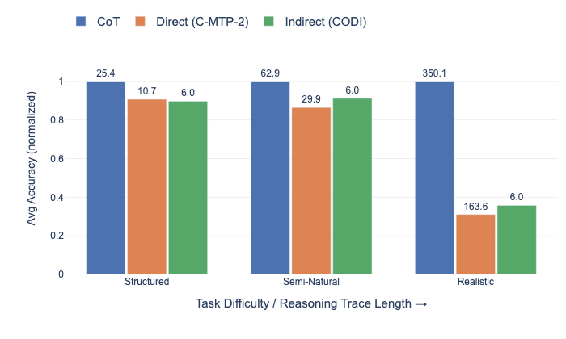

# Training Continuous Chain of Thought Models: A Tale of Two Regimes

Paper Link: [Arxiv]()

# Abstract
> Continuous Chain-of-Thought (ContinuousCoT) replaces verbose reasoning traces with dense latent representations. Training methods typically fall into two regimes: Indirect Supervision, which autoregressively generates latents during training, and Direct Supervision, which leverages CoT traces directly for fully parallel training. We introduce C-MTP, a direct supervision approach that predicts the tokens corresponding to each intermediate latent and aggregates their embeddings to feed into the next step, naturally extending next-token prediction without ad-hoc latent modeling. We show that our approach significantly outperforms existing direct supervision methods across diverse evaluation settings. We also conduct a systematic empirical study of both regimes across three CoT trace difficulty levels: Structured, Semi-Natural, and Realistic. On compact, structured traces, direct supervision remains preferable for its efficiency and generalization. On verbose traces, indirect supervision dominates; its recurrent objective better compresses long reasoning into a fixed latent budget, whereas direct methods struggle with train-test mismatch due to teacher forcing. On long realistic traces generated by LLMs, both regimes significantly underperform standard CoT fine-tuning, revealing fundamental limitations in current ContinuousCoT training.


## Key Findings



| Trace type | Dataset | Best method |
|---|---|---|
| Structured (compact expressions) | GSM8k-Aug | Direct (C-MTP) — more efficient, better generalization |
| Semi-Natural (verbose text traces) | GSM8k-Aug-NL | Indirect (CODI) — recurrent objective handles long traces better |
| Realistic (LLM-generated traces) | MATH | Both underperform standard CoT fine-tuning |

## Todo for Repo

- [ ] Upload checkpoints for cot, cmtp and codi.
- [ ] Add arXiv paper link
- [ ] Fill in the citation


## Repository Structure

```
cmtp_research/
├── cmtp/          # C-MTP: Direct supervision method
├── codi/          # CODI: Indirect supervision method
├── data_gsm/      # Data preparation for Structured and Semi-Natural settings
├── data_math/     # Data preparation for Realistic (MATH) setting
└── misc/          # Generation analysis scripts (self-consistency, dumps)
```

## Installation

Create a conda environment with the right Python version and install the dependencies:

```bash
conda create -n cmtp python=3.13.5 -y
conda activate cmtp
pip install -r requirements.txt
```

`torch` and `flash-attn` are CUDA-specific — adjust their versions to match your CUDA build if needed.


## Data Preparation

Three levels of CoT trace difficulty are used. See [data_gsm/README.md](data_gsm/README.md) and [data_math/README.md](data_math/README.md) for preparation steps.

| Level | Dataset | `data_name` |
|---|---|---|
| Structured | GSM8k-Aug (arithmetic expressions) | `icot` |
| Semi-Natural | GSM8k-Aug-NL (text traces) | `icot-nl` |
| Realistic | MATH (LLM-generated traces) | `mathllama` / `mathqwen` |

See Table 7 in paper for examples for each type.


## Running

- **C-MTP (Direct Supervision):** See [cmtp/README.md](cmtp/README.md)
- **CODI (Indirect Supervision):** See [codi/README.md](codi/README.md)
- **Baselines (SimCoT, CoLaR):** Run with their respective external codebases: [Sim-CoT](https://github.com/InternLM/SIM-CoT)and [CoLaR](https://github.com/xiaomi-research/colar/tree/main)

Both methods support `meta-llama/Llama-3.2-1B-Instruct` and `Qwen/Qwen2.5-1.5B-Instruct`. All experiments use LoRA (r=128, α=32) with `flash_attention_2`.

The evaluation scripts reproduce the numbers reported in the paper.

**Hardware.** All runs use a single NVIDIA H200 GPU. C-MTP training runs take a few hours; CODI runs take up to a day.


## Acknowledgements

This codebase builds on [CODI](https://github.com/zhenyi4/codi). The baseline experiments use [Sim-CoT](https://github.com/InternLM/SIM-CoT) and [CoLaR](https://github.com/xiaomi-research/colar/tree/main).


## Citation

